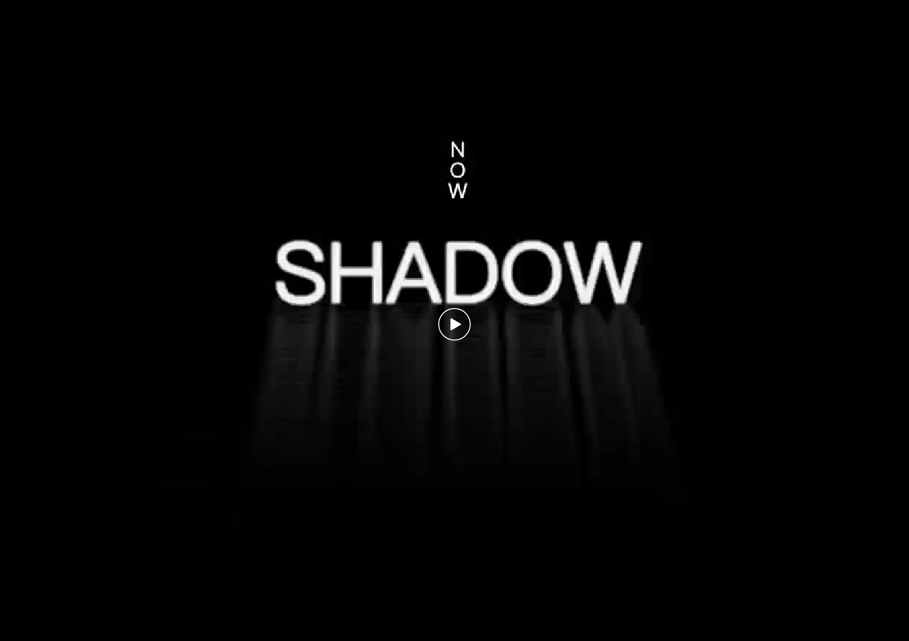
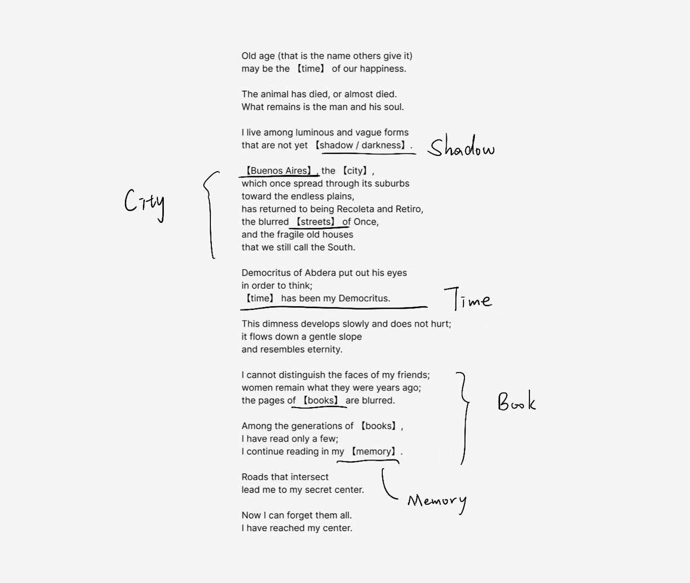
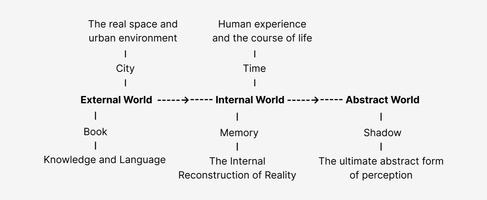

# Shadow Poetry

## Author
Yirun Ye & Shuran Zhang 

March 2026

## Video

## Blurb (Project Description)

This project is inspired by a passage from *Elogio de la sombra* (*In Praise of Darkness*) by Jorge Luis Borges.

In this poem Borges describes how, as vision gradually fades, the world transforms from clear physical reality into blurred shadows. When sight weakens, memory and language become the primary ways through which the world is perceived.

Based on this idea, we extracted key nouns from the poem and reorganized them into a conceptual structure:

In our project, we attempt to **visualise memory inside the mind**.  
Objects detected by the camera are translated into these poetic nouns and trigger corresponding visual behaviours.

Through this interaction, the system converts real-world objects into poetic language and visual motion, allowing viewers to interact with a computational representation of memory.

The project explores how machine perception can transform physical reality into poetic abstraction.

## Technical Approach

The system combines **machine learning–based image recognition with generative visual rendering**.

Image datasets were collected and trained using **Google Teachable Machine**, allowing the model to classify several predefined visual categories: **Book, City, Time, Memory, and Shadow**. The trained model is exported and integrated into the project using **ml5.js**, enabling real-time image recognition through the webcam.

When the camera detects an image corresponding to one of the trained categories, the system maps the recognition result to a specific generative visual behaviour implemented in **p5.js**.

This pipeline allows real-world visual input to be translated into generative poetic visuals, forming an interactive system that connects **machine perception, typography, and visual abstraction**.

## Instructions (How to Run)

1. Open the project folder.
2. Run the local server (for example using Live Server in VSCode).
3. Allow camera access in the browser.
4. Show one of the predefined image cards to the camera.
5. The system will recognise the image and trigger the corresponding visual behaviour.

Recognised categories include:

- Book
- City
- Time
- Memory
- Shadow

Each category generates a different visual response.

## Acknowledgements

- Jorge Luis Borges for the poem *Elogio de la sombra*
- Zhu Yingchun for the concept of poetic typography in *Design Poetry*
- Course tutors and classmates for conceptual discussions

## References

Borges, J. L. (1969). *Elogio de la sombra*. Buenos Aires.

Borges, J. L. (1974). *In Praise of Darkness*. English translation.

Zhu, Y. (2017). *Design Poetry*. Guangxi Normal University Press.

## Links

Jorge Luis Borges  
https://en.wikipedia.org/wiki/Jorge_Luis_Borges

Elogio de la sombra (Poem information)  
https://www.poetryfoundation.org/

Teachable Machine  
https://teachablemachine.withgoogle.com/

